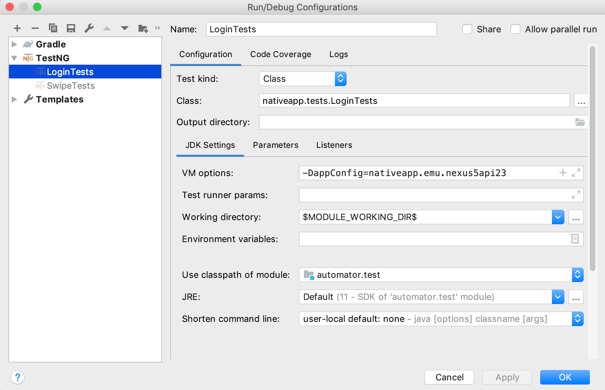

# The Automator

## About

Mobile testing solution based on Java, Gradle, TestNG and Appium.

## Execute Tests

### IDE

Tests can be executed against multiple device configs.
Configs are located in `<project-root>/src/test/resources`.

When execute tests via IDE you should specify config as VM option like this:
```
-DappConfig=nativeapp.dev.lgg6
```


### Commandline

Example:
```
./gradlew clean test --tests "nativeapp.tests.*" -PappConfig=nativeapp.dev.lgg6
```
This will run all test classes from `nativeapp.tests` package on configuration specified in `nativeapp.dev.lgg6` properties file.

### TIPs & Tricks

#### Create or Update Gradle Wrapper

```
gradle wrapper --gradle-version 5.4.1 --distribution-type all
```

#### Tips for Testing Hybrid Apps and Mobile Web

**Inspect Elements**
- [Remote Debugging Android Devices](https://developers.google.com/web/tools/chrome-devtools/remote-debugging/?utm_source=dcc&utm_medium=redirect&utm_campaign=2016q3)

**ChromeDriver Versions Table**
- [ChromeDriver Versions Table](http://appium.io/docs/en/writing-running-appium/web/chromedriver/)

**Solve the issue with download and setup ChromeDriver**
- [WebDriver Manager](https://github.com/bonigarcia/webdrivermanager)

**Tutorials**
- [Automating hybrid apps](http://appium.io/docs/en/writing-running-appium/web/hybrid/)
- [Automating Cross-Platform Hybrid Apps](https://appiumpro.com/editions/17)
- [No Chromedriver found that can automate Chrome '53.0.2785'](https://stackoverflow.com/questions/52023111/no-chromedriver-found-that-can-automate-chrome-53-0-2785)

#### Image Based Testing
- [opencv4nodejs](https://www.npmjs.com/package/opencv4nodejs#how-to-install)
- [Install opencv4nodejs on Windows](docs/opencv4nodejs.md)
- [Find By Image - Official Docs](http://appium.io/docs/en/advanced-concepts/image-elements/)
- [Finding Elements By Image, Part 1](https://appiumpro.com/editions/32)
- [Finding Elements By Image, Part 2](https://appiumpro.com/editions/33)

#### Running Tests on SauceLabs

Set following environment variables:
```
SAUCE_USER_NAME=<your-sauce-user-name>
SAUCE_ACCESS_KEY=<your-sauce-access-key>
```
or specify following in properties config file:
```
sauceUserName=dtop
sauceAccessKey=test
```

### Setup CI with Jenkins

- Please read [Jenkins.md](docs/Jenkins.md)